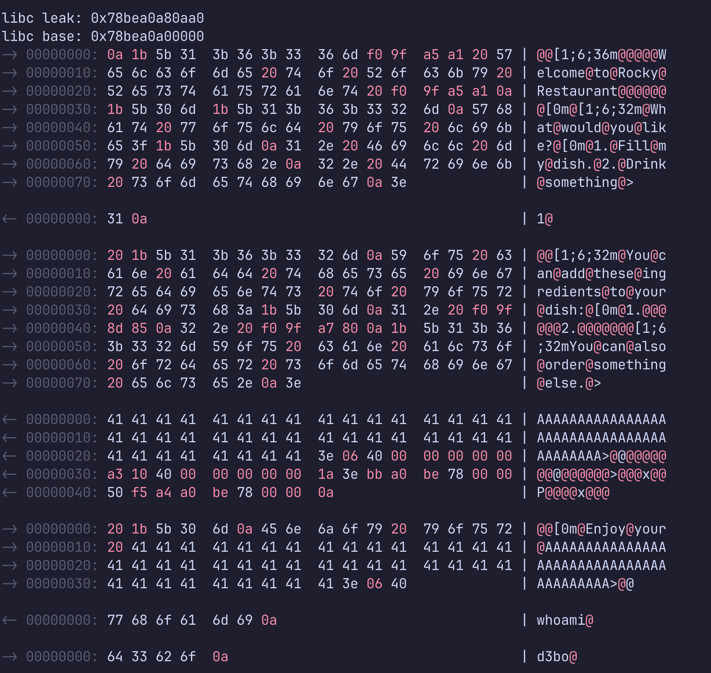

# pawlib

```
git clone https://github.com/d3b0o/pawlib 
cd pawlib
sudo make install
make clean
```

```
make example
```

A project inspired by pwntools but implemented in C, currently in the early stages of development.

- Example using "ls": [example.c](template/example.c) (You can test it with `make example`)
- Example solver for the restaurant challenge from hackthebox: [example_solver.c](templates/example_solver.c)


